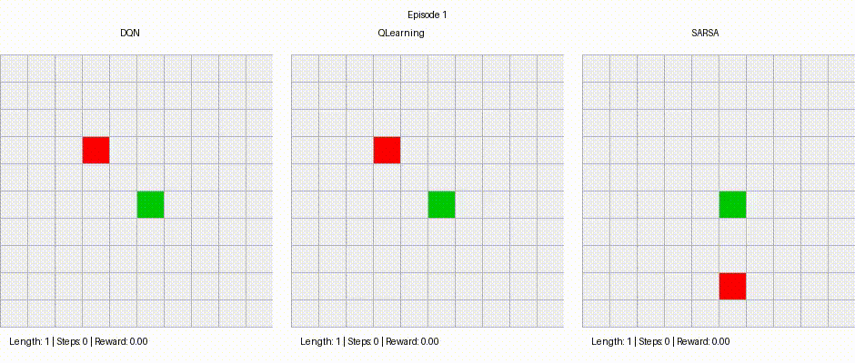

# Reinforcement Learning для игры Snake

Проект реализует и сравнивает три value-based RL-алгоритма (Reinforcement Learning) для классической игры Snake.

## Содержание
- [Описание задачи](#описание-задачи)
- [Ключевые особенности](#ключевые-особенности)
- [Сравнительный анализ](#сравнительный-анализ)
- [Результаты](#результаты)
- [Демонстрация работы](#демонстрация-работы)
- [Установка и запуск](#установка-и-запуск)

---

## Описание задачи

Агент (змейка) должен научиться:
- Эффективно находить и собирать еду
- Избегать столкновений со стенами
- Избегать столкновений с собственным телом
- Максимизировать длину змейки и время выживания

Среда реализована в соответствии с интерфейсом Gymnasium, что позволяет легко интегрировать и тестировать различные алгоритмы RL.

---

## Ключевые особенности

- **Полностью совместимая с Gymnasium среда `SnakeEnv`**:
  - 13-мерное векторное представление состояния
  - Дискретные действия (4 направления)
  - Запрет поворота на 180°
  - Рендеринг в режимах `human` и `rgb_array`

- **Реализованные алгоритмы**:
  - **DQN** (Deep Q-Network) с нейросетевой аппроксимацией Q-функции
  - **Q-learning** (табличный метод)
  - **SARSA** (табличный метод)

- **Особенности обучения**:
  - Использование Replay Buffer и Target Network в DQN
  - ε-greedy стратегия исследования
  - Базовая функция награды без reward shaping

---

## Сравнительный анализ

| Аспект               | DQN                          | Q-learning              | SARSA                   |
|----------------------|------------------------------|-------------------------|-------------------------|
| **Тип алгоритма**    | Нейросетевой                 | Табличный               | Табличный               |
| **Обучение**         | Off-policy                   | Off-policy              | On-policy               |
| **Состояние**        | 13-мерный вектор (13D)       | Дискретизированное (7D) | Дискретизированное (7D) |
| **Скорость обучения**| Медленнее                    | Быстрее                 | Быстрее                 |
| **Аппроксимация**    | Нейросеть                    | Q-таблица               | Q-таблица               |

---

## Результаты

Статистика за 1_000 эпизодов:

| Алгоритм   | Mean foods  | Std foods              | Mean reward     | Std reward             |
|------------|-------------|------------------------|-----------------|------------------------|
| DQN        | 18          | 8.112                  | 168.472         | 80.251                 |
| Q-learning | 20          | 6.148                  | 188.178         | 60.806                 |
| SARSA      | 17.6        | 5.783                  | 164.478         | 57.028                 |

**Выводы:**
- Математическое ожидание числа съеденной еды > 10 за 1_000 шагов
- Сопоставимое качество всех 3 алгоритмов показывают корректность реализации value-based алгоритмов
- Табличные методы обучаются значительно быстрее

---

## Демонстрация работы


*Более подробная информация о методологии, экспериментах и выводах представлена в [полном PDF-отчёте](report.pdf)*

---

## Установка и запуск

### Требования
- Python 3.8+
- Jupyter Notebook/JupyterLab
- Установленные зависимости из файла `requirements.txt`

### 1. Клонирование репозитория
```bash
git clone https://github.com/dedkoster/snake_agent.git
cd snake_agent
```

### 2. Установка зависимостей
```bash
pip install -r requirements.txt
```

### 3. Запуск Jupyter Notebook
```bash
jupyter notebook
```

### 4. Работа с проектом
   - Откройте файл `main.ipynb` в Jupyter
   - Запускайте ячейки последовательно для:
     - Воспроизведения обучения всех стратегий
     - Генерации графиков и таблиц
     - Демонстрации работы агентов

### Быстрый старт
Если хотите просто посмотреть результаты: откройте `main.ipynb`